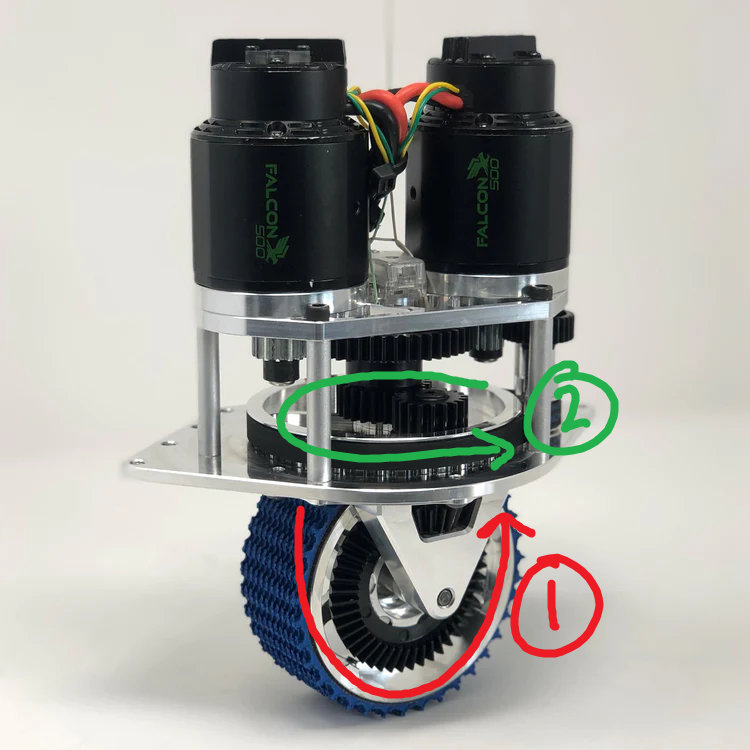

####
格式
####

以下是一些常用的各式。

Variable 命名
*************

- 實例變數： ``m[VARIABLE_NAME]`` (e.g. ``mMotorController``)

- 常數： ``k[VARIABLE_NAME]`` (e.g. ``kMotorControllerID``)

Swerve 零件命名
***************

    Swerve 零件； `來源 <https://www.swervedrivespecialties.com/collections/kits/products/mk4-swerve-module>`_

1. **Throttle**: 控制輪子的旋轉
2. **Rotor**: 控制輪子的角度 (Throttle Encoder 量 rotor 的角度）

SwerveModule 順序
*****************

這個 documentation 裡 Swerve Modules 的順序：

1. 左前方
2. 右前方
3. 左後方
4. 右後方

.. figure:: ../Photos/AnnotatedSwerveDrive.png
    :alt: Swerve Module Order
    :target: https://www.reddit.com/r/FRC/comments/mrhzks/the_mk2_swerve_drive_from_swerve_drive/
    :scale: 50%
    
    Swerve Module 順序；來源
    