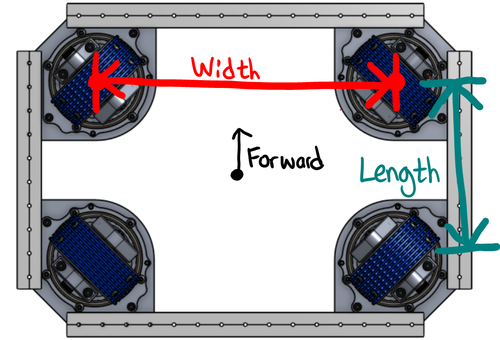

####################
Swerve Configuration
####################

開始寫 swerve 的程式前，你需要搜集你的機器人特定的 constant，而它會被用
來配置你的 swerve。所有的 constant 都會記錄在 ``Constants.java``. 

Motor & Sensor IDs
******************

請紀錄 rotor 和 throttle 馬達的 CAN IDs。

.. code-block:: java
    :linenos:

    // Rotor IDs
    public static final int kLeftFrontRotorID = 0;
    public static final int kRightFrontRotorID = 0;
    public static final int kLeftRearRotorID = 0;
    public static final int kRightRearRotorID = 0;

    // Throttle IDs
    public static final int kLeftFrontThrottleID = 0;
    public static final int kRightFrontThrottleID = 0;
    public static final int kLeftRearThrottleID = 0;
    public static final int kRightRearThrottleID = 0;

請紀錄 rotor encoders 和 IMU 的 CAN 或 analog IDs（若是用 navX 可以跳過這一步）。

.. code-block:: java
    :linenos:

    // Rotor Encoder IDs
    public static final int kLeftFrontRotorEncoderID = 0;
    public static final int kRightFrontRotorEncoderID = 0;
    public static final int kLeftRearRotorEncoderID = 0;
    public static final int kRightRearRotorEncoderID = 0;

    // IMU ID
    public static final int kImuID = 0;

Rotor Encoder 偏移量
********************

為了讓 swerve modules 的角度可以同步，你需要補償 rotor encoder 可能的偏移量。

首先，轉動 module ，讓所有的輪子都面對同一個方向。然後，確保 throttle 馬達
有正面動力時，所有的輪子會轉同一個方向。

    `來源 <https://www.youtube.com/watch?v=wCakzMfRPKs&ab_channel=Orbit1690>`_

把每個 module 的 rotor encoder 數值記錄在 Constants.java 裡。

.. code-block:: java
    :linenos:
    
    public static final double kLeftFrontRotorOffset = -1 * LEFT_FRONT_ANGLE;
    public static final double kRightFrontRotorOffset = -1 * RIGHT_FRONT_ANGLE;
    public static final double kLeftRearRotorOffset = -1 * LEFT_REAR_ANGLE;
    public static final double kRightRearRotorOffset = -1 * RIGHT_REAR_ANGLE;

.. note::
    
    Rotor 的偏移量會被加到 rotor encoder value。這是 rotor 偏移量要乘於 -1 的原因。

Rotor 馬達 & Encoder Inversion
******************************

Rotor 馬達和 encoder 可能需要倒置。當 rotor motor 有 正面動力時，rotor encoder 的
數值應該要增加。如果不是這樣，你會需在 ``Constants.java`` 裡，把 馬達 / encoder 的 
boolean value 改成 true。這樣就可以倒置 rotor 馬達或 encoder。

.. code-block:: java
    :linenos:

    public static final boolean kRotorEncoderDirection = false;
    public static final boolean kRotorMotorInversion = false;

Swerve Kinematics
*****************

紀錄機器人的長度與寬度（已米為單位）。因為正面 X 是往前，而正面 Y 是往
左，configuration 應該要長得像這樣。

.. code-block:: java
    :linenos:

    // Swerve module 順序：左前，右前，左後，右後
    public static final SwerveDriveKinematics kSwerveKinematics = new SwerveDriveKinematics(
        new Translation2d(LENGTH/2, WIDTH/2), 
        new Translation2d(LENGTH/2, -WIDTH/2), 
        new Translation2d(-LENGTH/2, WIDTH/2),
        new Translation2d(-LENGTH/2, -WIDTH/2)
    );

多餘的 Constants
****************

最大速度 / 加速度
----------------

請紀錄機器人最大的速度與加速度（米）。

.. code-block:: java
    :linenos:

    public static final double kMaxVelocityMetersPerSecond = 0.0;
    public static final double kMaxAccelerationMetersPerSecond = 0.0;

輪徑
----

請紀錄 swerve wheel 的直徑（米）。

.. code-block:: java
    :linenos:

    public static final double kWheelDiameterMeters = 0.0;

Throttle 齒輪比率
-----------------

請紀錄 throttle 齒輪比率（馬達轉動輪子一圈所需的圈數）。

.. code-block:: java
    :linenos:

    public static final double kThrottleGearRatio = 0.0; 

Throttle 速度轉換 Constant
--------------------------

使用以上的 constant，你可以算出從 throttle encoder 速度轉換成線性速度（米/秒）所需要的轉換 constant。

.. tabs::

    .. tab:: Spark Max (Neo)

        :math:`conversion = \frac{1}{gear ratio} \times \frac{1}{60} \times {wheel diameter} \times \pi`

        .. code-block:: java
            :linenos:

            public static final double kThrottleVelocityConversionFactor = 
                1/kThrottleGearRatio/60*kWheelDiameterMeters*Math.PI;

    .. tab:: Talon FX (Falcon 500)

        :math:`conversion = \frac{1}{gear ratio} \times \frac{1}{2048} \times {wheel diameter} \times \pi \times 10`

        .. note::

            乘於 :math:`10` 是為了要從 100ms 轉換成 1s，因為 Talon FX 是使用 100ms 來
            量速度的。 :math:`\frac{1}{2048}` 是用來把 Falcon encoder tick 轉換成圈數。

        .. code-block:: java
            :linenos:

            public static final double kThrottleVelocityConversionFactor = 
                1/kThrottleGearRatio/2048*kWheelDiameterMeters*Math.PI*10;